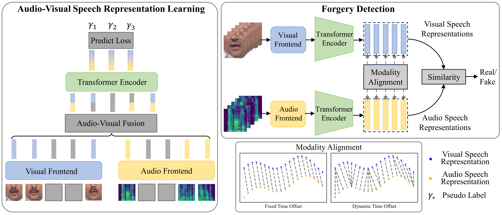

# AVSR-forensics
This is a PyTorch implementation of 'What I See is not What I Hear: Audio-Visual Speech Representation Learning for Forgery Detection'.


## Setup
### Prerequisite

1. Install [AV-Hubert](https://github.com/facebookresearch/av_hubert) by following his installation.
2. Install supplementary packages via 'pip install -r requirements.txt'
3. Install FFmpeg. We use version=4.2.2.
4. Replace with 

### Prepare data
1. Follow the links below to download the datasets (you will be asked to fill out some forms before downloading):
    * [FaceForensics++](https://github.com/ondyari/FaceForensics) (Download the [audio](https://github.com/ondyari/FaceForensics/tree/master/dataset#audio) according to the youtube ids and extract audio clips using the frame numbers that can obtained by downloading the 'original_youtube_videos_info'. )
    ```(We provide the version with audio. Alternatively, you can download the [audio](https://github.com/ondyari/FaceForensics/tree/master/dataset#audio) according to the youtube ids and extract audio clips using the frame numbers that can obtained by downloading the 'original_youtube_videos_info'. )```
    * [FakeAVCeleb](https://github.com/DASH-Lab/FakeAVCeleb)
    * [KoDF](https://github.com/deepbrainai-research/kodf)
2. Detect the faces and extract 68 face landmarks. For example, you can use [RetinaFace](https://github.com/biubug6/Pytorch_Retinaface) and [FAN](https://github.com/1adrianb/face-alignment).
3. To crop the mouth region from each video, run
    ```bash
   python preprocessing/align_mouths.py --input_dir $input_dataset_dir --landmarks_dir $landmarks_dir --output_dir $out_dir
    ```
    This will write the mouth 


## Evaluate